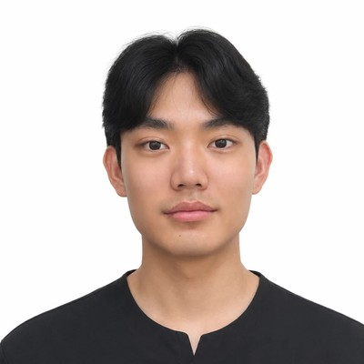
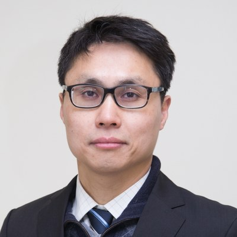
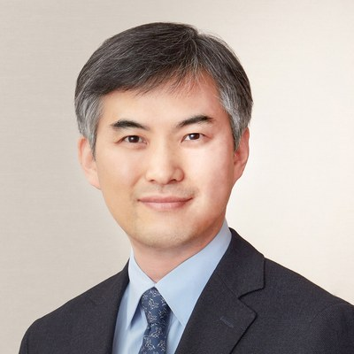
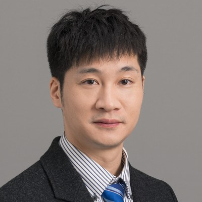

# Team

## Researchers

- { .team-photo }

    **Taehyun Han** &nbsp;한태현

    Undergraduate, Yonsei University. Dual major in Nano Science and
    Engineering (Integrated Science and Engineering Division, Underwood
    International College) and Computer Science and Engineering (College of
    Computing).

- { .team-photo }

    **Sehun Chun** &nbsp;천세훈

    Associate Professor of Applied Mathematics,
    Underwood International College, Yonsei University.
    Director of the HINEC project.

    [sites.google.com/site/uicschun](https://sites.google.com/site/uicschun/)

## Advisory Faculty Board

- { .team-photo }

    **Hae-Jeong Park** &nbsp;박해정

    Professor, Graduate School of Medical Science and Engineering;
    Department of Nuclear Medicine, College of Medicine; and the
    interdisciplinary Cognitive Science program, Yonsei University.

    Principal Investigator, Monet Lab.

    [neuroimage.yonsei.ac.kr](http://neuroimage.yonsei.ac.kr/principle-investigator/)

- { .team-photo }

    **Vinoth Jagaroo**

    Associate Professor of Cognitive Neuroscience, Brain-Behavioral Sciences,
    Emerson College. Affiliate Faculty and Clinical Instructor, Neuroanatomy &
    Neuroscience, The Behavioral Neuroscience Ph.D. Program, Graduate Medical
    Sciences, Boston University Chobanian & Avedisian School of Medicine.

    [sites.bu.edu/jagaroo](https://sites.bu.edu/jagaroo/)

- { .team-photo }

    **Linyu Peng** &nbsp;彭 林玉

    Associate Professor (PI), Department of Mechanical Engineering,
    Keio University.

    Adjunct Researcher, Institute for Applied Mathematics and Sciences,
    Waseda University. Part-time Lecturer, Faculty of Science and Engineering,
    Waseda University.

    [peng.mech.keio.ac.jp](http://www.peng.mech.keio.ac.jp/faculty/index.html)

## Contributors

- **Youngwoo Kim**

---

Source: [github.com/uicneuro/hinec](https://github.com/uicneuro/hinec)
