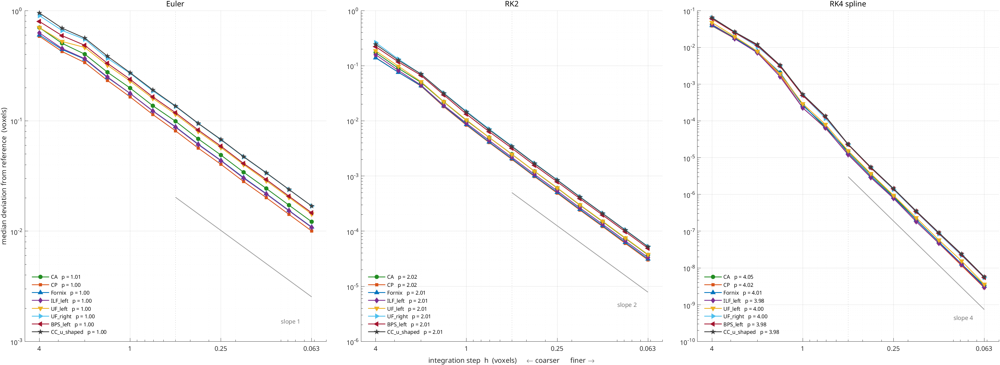
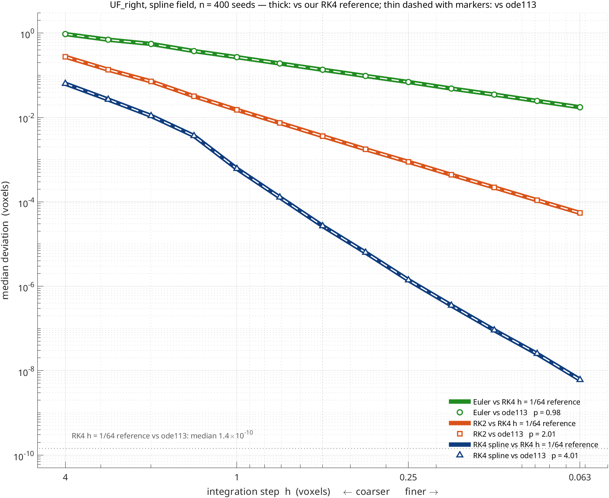

# Solution Verification

Streamline tractography is the numerical solution of an ordinary differential
equation, $d\mathbf{x}/ds = \mathbf{v}(\mathbf{x})$. This page establishes that
HINEC's solver converges under refinement of both discretisations — the
integration step and the spatial sampling of the direction field — and measures
the rate of each.

!!! abstract "Result"
    Both axes converge monotonically at stable power-law rates. Under step
    refinement the integrators reach their formal orders: Euler $0.99$, RK2
    $2.01$, RK4 $\mathbf{4.00}$ with a $C^2$ spline interpolant. Under spatial
    refinement the order is $\approx 2.25$. **Spatial resolution is the binding
    constraint**: past a moderately coarse step there is little left to gain from
    refining time. The same orders hold across eight bundles, including the
    most curved ones, and the ladder is unchanged when the reference is replaced
    by an **independent integrator** (`ode113`): the solver converges to the true
    solution of its ODE, not merely to itself.

!!! note "Scope — verification, not validation"
    Verification asks whether the equations are being solved correctly.
    Validation asks whether the answer corresponds to anatomy. This page is the
    former only, and no claim about anatomical accuracy follows from anything
    below. The ISMRM ground-truth bundles appear here solely to define a seed
    region; for how the streamlines actually measure against them, see
    [ISMRM Scoring](ISMRM_SCORING_ANALYSIS.md), where between 28% and 62% of
    produced streamline length leaves the bundle it was seeded in.

---

## Method

### The problem

Streamline tractography integrates $d\mathbf{x}/ds = \mathbf{v}(\mathbf{x})$,
where $\mathbf{v}$ is the principal eigenvector field and $|\mathbf{v}| = 1$, so
the parameter $s$ is arc length. Seeds are the 8,384 voxels of the ISMRM
ground-truth `UF_right` bundle mask with FA > 0.15.

The angle termination criterion is **disabled** (`angle_max: 0`). It is a
stopping rule whose budget scales with the step size, and a rule that changes
with the refinement parameter is not a fixed problem to converge to.


*The seed region. Grey is the ISMRM ground-truth `UF_right` bundle, red is ours,
segmented by the scorer's full definition (head/tail endpoints, containment, and
any inclusion or length criteria the bundle declares). Shown only to establish
what the convergence ladders are tracking through — it is a validation figure and
the ladders do not depend on it.*

!!! note "Do not read this as an accuracy claim"
    Convergence is *solution verification* — it shows the discretisation is solved
    correctly, not that the answer is anatomically right. Those are independent,
    and this pipeline is demonstrably good at the first and middling at the
    second: the same tracker that converges at observed order 4.00 recovers
    **49% of the `UF_right` ground-truth volume**, with 75% of its streamline
    length falling inside that bundle. Whole-brain, it scores mean F1 0.346.
    The limit is the single-tensor model, not the numerics. See
    [ISMRM Scoring](ISMRM_SCORING_ANALYSIS.md#reconstruction-against-ground-truth).

### The error metric

Each run is compared against a reference run. Both are streamline *sets*, so the
comparison must decide which streamline corresponds to which, and then which
point corresponds to which. `nim_convergence_error` does this in six steps:

1. **Pair by seed.** Matched through `track_meta.seed_index`, not by position in
   the array — the tracker compacts out seeds that produce nothing, so
   "streamline 7" is a different fibre in the two runs.
2. **Anchor at the seed.** A track is stored as
   `[reversed backward half; seed; forward half]`, so index 1 is a *termination*
   point. Arc is measured outward from the seed.
3. **Parameterise by nominal arc.** The point $n$ steps from the seed is at arc
   $nh$ *by construction*, since each step advances exactly $h$ of arc.
   Cumulative chord length is not used: it underestimates true arc by
   $h^2/(24R^2)$ per unit length, putting the two runs on parameters that
   disagree at $O(h^2)$.
4. **Window to ±10 voxels** about the seed, using only streamlines that reach
   that in both directions in both runs. This excludes termination, which is a
   discontinuous function of $h$.
5. **Compare the test track's own stored points** against a splined reference.
   The test points are exact integrator output and are not interpolated;
   resampling them linearly imposes a chord-error floor of $\approx h^2/(8R)$
   that has nothing to do with the integrator.
6. **Reduce.** Median over the streamlines measurable at *every* rung — a fixed
   population. The 95th percentile is tracked separately.

!!! warning "Steps 3 and 5 both matter at $O(h^2)$"
    Either one, done naively, imposes a floor no integrator can beat and reports
    order 2 for every method regardless of the tableau — which is
    indistinguishable from a genuine physical cap **unless methods with known
    formal orders are run alongside as a control**.

### Reference solutions

One shared reference per experiment, always the most accurate configuration
available, **never a refined copy of the method under test**. Referencing Euler
to Euler leaves the reference carrying ~25% of the error being measured at the
finest rung, and inflates Euler's observed order from 0.99 to 1.24.

---

## Refinement in time

Nine step sizes, refined in ratios of $\sqrt{2}$ from 0.5 to 0.03125 voxels; reference RK4
at $h = 0.0078125$; fixed population $n \approx 1300$.

| method | field | formal | $h=0.5$ | $h=0.031$ | **observed** |
|---|:--:|:--:|--:|--:|--:|
| Euler | — | 1 | 1.33e-1 | 8.41e-3 | **0.99** |
| RK2 | — | 2 | 3.43e-3 | 1.30e-5 | **2.01** |
| RK4 trilinear | $C^0$ | 4 | 5.05e-4 | 1.91e-6 | **2.00** |
| RK4 cubic | $C^1$ | 4 | 6.58e-5 | 1.35e-8 | **3.06** |
| RK4 spline | $C^2$ | 4 | 2.12e-5 | 3.05e-10 | **4.00** |


Euler and RK2 land on their formal orders. Because those two answers are known
in advance they serve as a **control on the measurement itself**: a metric that
reports 0.99 and 2.01 for methods whose orders are 1 and 2 is measuring the
integrator and not an artefact of its own.

**The observed order of RK4 is set by the smoothness of the interpolant** — one
order per continuous derivative, until the tableau's formal order is reached.
The three RK4 rows differ *only* in the interpolation kernel.

Local slopes are stable across every triplet (the asymptotic-range condition),
and the 95th percentile converges at the same rate as the median, so the whole
distribution converges rather than a well-behaved majority.

---

## The same ladder on curved and irregular bundles

The `UF_right` result above could be a property of one gently curved bundle. The
same time ladder was therefore run on eight bundles chosen for curvature and
awkward geometry — anterior commissure (`CA`), posterior commissure (`CP`),
fornix, left inferior longitudinal fasciculus, both uncinates, the left
brainstem projection (`BPS_left`) and the U-shaped callosal fibres
(`CC_u_shaped`) — with 13 rungs from $h = 4$ to $0.0625$
(ratio $\sqrt 2$), spline interpolation, and a shared RK4 $h = 1/64$ reference
per bundle. Seed density 1 per voxel, FA > 0.15, window ±10 voxels.

| bundle | seeds | Euler | RK2 | RK4 spline | RK4 median at $h=0.5$ |
|---|--:|:--:|:--:|:--:|--:|
| CA | 427 | 1.01 | 2.02 | 4.05 | 1.49e-5 |
| CP | 1869 | 1.00 | 2.02 | 4.02 | 1.24e-5 |
| Fornix | 3965 | 1.00 | 2.01 | 4.01 | 1.35e-5 |
| ILF_left | 1850 | 1.00 | 2.01 | 3.98 | 1.21e-5 |
| UF_left | 1208 | 1.00 | 2.01 | 4.00 | 1.53e-5 |
| UF_right | 1478 | 1.00 | 2.01 | 4.00 | 2.29e-5 |
| BPS_left | 6509 | 1.00 | 2.01 | 3.98 | 2.27e-5 |
| CC_u_shaped | 14509 | 1.00 | 2.01 | 3.98 | 2.32e-05 |

*Observed order = slope of $\log(\text{median})$ against $\log h$ over the
rungs $h \le 0.5$. Every ladder is monotone over that range.*



The orders do not move with curvature, and they should not: the order of a
Runge–Kutta method is a property of the integrator on a smooth field. Curvature
enters the error *constant* — the vertical offset of each line — not the
exponent. What curvature does change is the step at which a given accuracy is
reached: for Euler the largest step with median error below 0.05 voxels ranges
from 0.19 (`UF_right`) to 0.31 (`CP`). At $h = 4$ the coarse end of every
ladder is pre-asymptotic (curved lines at the left of the figure), which is why
the fit is restricted to $h \le 0.5$.

Individual streamlines do exist whose error is not monotone in $h$: on the
`UF_right` RK4 rung $h = 0.71 \to 0.5$, 40 of 1525 seeds got *worse* on
refinement. Their departure points sit at near-planar tensors — median
$\lambda_2/\lambda_1$ 0.84, against 0.68 over all points the bundle traverses
(rank-sum $p = 3\times10^{-6}$) — where the principal direction of the
interpolated dyadic is ill-conditioned and a small change in the path flips
which eigenvector wins. They are a property of the field, not the integrator,
and do not survive the median.

---

## An independent reference

Every ladder above measures distance to *our own* tracker at a small step. A
systematic error shared by every rung — a bias in the direction field, a
sign-alignment rule, an off-by-half-step in the sampling — would be invisible to
such a ladder, which would still report perfect slopes. This is the sense in
which self-convergence shows consistency but not correctness.

To close that gap the same spline dyadic field was handed to MATLAB's `ode113`
(variable-order Adams–Bashforth–Moulton, `AbsTol = RelTol = 10^{-13}`), which
shares no code with `rk4_integration_step`: no fixed step, no tableau, no
sign-alignment logic beyond the one-line `dot(v, v_prev) < 0` flip inside the
right-hand side. Each ladder rung on `UF_right` (400 seeds, same ±10-voxel
window) was then measured against both references.

| method | $h$ | vs `ode113` | vs RK4 $h = 1/64$ |
|---|--:|--:|--:|
| Euler | 0.5 | 1.3512e-1 | 1.3512e-1 |
| Euler | 0.0625 | 1.7453e-2 | 1.7453e-2 |
| RK2 | 0.5 | 3.6051e-3 | 3.6051e-3 |
| RK2 | 0.0625 | 5.4716e-5 | 5.4716e-5 |
| RK4 spline | 0.5 | 2.6717e-5 | 2.6717e-5 |
| RK4 spline | 0.0625 | 6.0485e-9 | 6.0845e-9 |
| **fitted order** ($h \le 0.5$) | | **0.984 / 2.012 / 4.014** | **0.984 / 2.012 / 4.014** |



The two columns agree to three or four significant digits at every rung, and
the RK4 $h = 1/64$ reference itself sits a median $1.4\times10^{-10}$ voxels
(p95 $3\times10^{-8}$) from the `ode113` solution. The tracker converges to the
solution of the ODE it claims to solve, at the rate it claims. The remaining
question — whether that ODE is the right one for the anatomy — is validation and
is not addressed here.

### The one seed that disagrees

Of the 400 seeds, one differs from `ode113` by 2.9 voxels (the next-worst seven
are all below $5\times10^{-3}$). It is seed 467 at voxel `[25 53 22]`, backward
half only. The two integrators agree to $6\times10^{-6}$ voxels until arc
$-0.66$ and separate within the next 0.15 voxels of arc, where the streamline
is at $z \approx 21.4$, between

- voxel `(25,53,22)`: FA 0.612, $\mathbf v_1 = [-0.09,\ 0.40,\ 0.91]$, and
- voxel `(25,53,21)`: **in mask, FA 0, all eigenvalues 0,
  $\mathbf v_1 = [1, 0, 0]$** — a placeholder written where the tensor fit was
  skipped (its $b_0$ signal is 30 against 67 next door, below the fit threshold).

The interpolated dyadic between a real direction and the placeholder passes
through an exact eigenvalue crossing — $\lambda_1 - \lambda_2$ is 1.06 at
$z = 22$, 0.031 at $z = 21.4$, 0.37 at $z = 21.2$ — with the principal axis
rotating through ~90° across it. The right-hand side of the ODE is discontinuous
there, and two correct integrators may legitimately leave on different branches.
The FA stop does not intervene because FA is interpolated linearly from 0.612 to
0 and is still 0.25 at the crossing.

This is not an integrator error. It is a data-preparation defect: **3219**
in-mask voxels carry the `[1 0 0]` placeholder (2965 of them on the mask's outer
shell, 3183 adjacent to a voxel with FA ≥ 0.15), so any streamline that grazes
the mask edge sees a spurious $x$-axis direction bleed into the interpolant. The
fix is one line in `nim_field` — zero the dyadic where the tensor is zero, so the
field decays to nothing at the edge instead of rotating toward $x$ — but it
changes tracking near the boundary and needs a re-score before it is adopted.
It is recorded here as an open finding.

---

## Refinement in space

The direction field is sampled on a grid of spacing $1/u$ voxels before the
interpolants are built — see [`interpolation.upsample`](YAML_CONFIG.md). The
coordinate frame is unchanged, so positions, step sizes and lengths stay in
native voxel units and runs at different factors are directly comparable.

The integration step is pinned at $h = 0.125$ with RK4 and spline interpolation,
where the temporal error is $\approx 8\times10^{-8}$ voxels — four to six orders
below the spatial errors being measured.

| spacing (vox) | median | p95 | local $p$ |
|--:|--:|--:|--:|
| 8.000 | 1.0713 | 6.709 | — |
| 5.657 | 1.0167 | 5.148 | 0.15 |
| 4.000 | 0.5303 | 3.899 | 1.88 |
| 2.828 | 0.2924 | 2.520 | 1.72 |
| 2.000 | 0.1188 | 1.839 | 2.60 |
| 1.414 | 0.0476 | 0.193 | 2.64 |


Fitted order **2.25** over the four asymptotic rungs ($n = 761$), rising to
2.43–2.62 over the finest three. Error falls by a factor of 22 as the grid
refines 5.7×, and the p95 falls with it (6.71 → 0.19). The two coarsest rungs
are pre-asymptotic: at 8-voxel spacing the field is barely resolved and the
error saturates near one voxel.

!!! note "The limit is the native-resolution interpolant, not the anatomy"
    Sampling *above* the acquisition grid returns error that is exactly zero — a
    spline through samples of itself reproduces itself — which says the 2 mm
    samples already carry all the information there is. This ladder demonstrates
    grid convergence *of the algorithm*; whether 2 mm resolves the anatomy is a
    validation question requiring different data.

---

## Which axis binds

RK4 with spline interpolation converges at order 4 in time and $\approx 2.3$ in
space. **Resolution is the binding constraint.** Beyond a moderately coarse step
there is little to gain from refining time; effort is better spent on the
spatial representation of the direction field.

Practically: pair `interpolation.method: spline` with `integrator.method: rk4`.
At $h = 0.5$ that combination is 162× more accurate than RK2 and 6300× more
accurate than Euler, so the larger step fourth-order accuracy affords can be
taken without giving the accuracy back.

---

## What does not limit the observed order

Three candidate explanations were tested directly and **rejected**. The negative
results constrain what the numbers above can mean.

| tested | result |
|---|---|
| **Field noise** — a field whose every voxel direction is rotated through a random angle $\sigma$, swept 0–20° against the real field's measured median of 4.84° between adjacent voxels, with random per-voxel sign flips | RK4 stayed above order 2.5 and 2–756× ahead of RK2 throughout |
| **Coherent discontinuities** — a surface across which the principal direction jumps by up to 60°, crossed mid-integration (the shape a fibre crossing takes) | RK4 still finished near order 4 and 9× ahead of RK2 |
| **Stage fallbacks** — `rk4_integration_step` substitutes the previous stage when interpolation refuses a probe below the FA floor | 0.80% of probes, independent of $h$ — present, but far too small to govern the observed order |

---

## Threats to validity

- **One subject.** Every result is from the ISMRM 2015 phantom. The time ladder
  has been repeated on eight bundles; the space ladder and the `ode113`
  cross-check are `UF_right` only.
- **Verification, not accuracy.** The `ode113` cross-check shows the tracker
  converges to the true solution of its ODE, which removes the "converges only
  to itself" objection. It says nothing about whether that ODE — the principal
  eigenvector of a single tensor — is the right model of the tissue.
- **The spatial ladder is not fully asymptotic.** Local order is still rising at
  the finest rung, so 2.25 is a lower bound.
- **Termination is quantised to one step.** Measured arc-length difference is
  0.87–0.98 $h$ across a 16× refinement, so the endpoint converges at $O(h)$
  while the interior converges at the integrator's order. The windowed metric
  excludes this deliberately; it remains a real defect.
- **MMF is untested here.** The angle criterion in
  `nim_tractography_mmf_connframe` is covered only by a source-text check, not a
  behavioural test.
- **Mask-edge placeholders.** 3219 in-mask voxels carry a zero tensor with a
  default `[1 0 0]` eigenvector (see [the one seed that disagrees](#the-one-seed-that-disagrees)).
  Streamlines that graze the mask edge integrate through a discontinuous field
  there. The median statistics are unaffected; individual streamlines can be.

---

## Reproduction

```bash
# time ladder, one rung
./bin/run_tractography.sh reference \
    --set seeding.roi=UF_right --set seeding.fa_min=0.15 \
    --set interpolation.method=spline --set integrator.method=rk4 \
    --set integrator.step=0.125 --set output.arc_step=0

# space ladder, one rung — add
    --set upsample=0.5
```

```bash
# curved-bundle ladders: same command with --set seeding.roi=<CA|CP|Fornix|ILF_left|UF_left|UF_right|BPS_left|CC_u_shaped>
# and --set termination.max_arc=20, for h = 4, 2.83, 2, ..., 0.0625; reference at 0.015625
```

The `ode113` cross-check builds the identical `griddedInterpolant(..., 'spline')`
dyadic field, takes the principal direction with `nim_principal_dir`, and
integrates from each seed in both directions with `odeset('AbsTol',1e-13,'RelTol',1e-13)`;
each ladder rung is then compared to `deval` of that solution at its own nominal
arcs, using the same ±10-voxel window.

Analysis is `nim_convergence_error(test_run, reference_run, struct('prefix_arc', 10))`,
which returns per-seed errors so a fixed population can be intersected across
rungs.

Verification suite: **82/82** passing, including behavioural cases that
integrate real streamlines through synthetic fields of known analytic curvature —
order verification for each integrator, the angle criterion firing exactly at
the field's true turning rate, sign-invariance of the dyadic interpolation, and
the endpoint/containment bundle gates.
