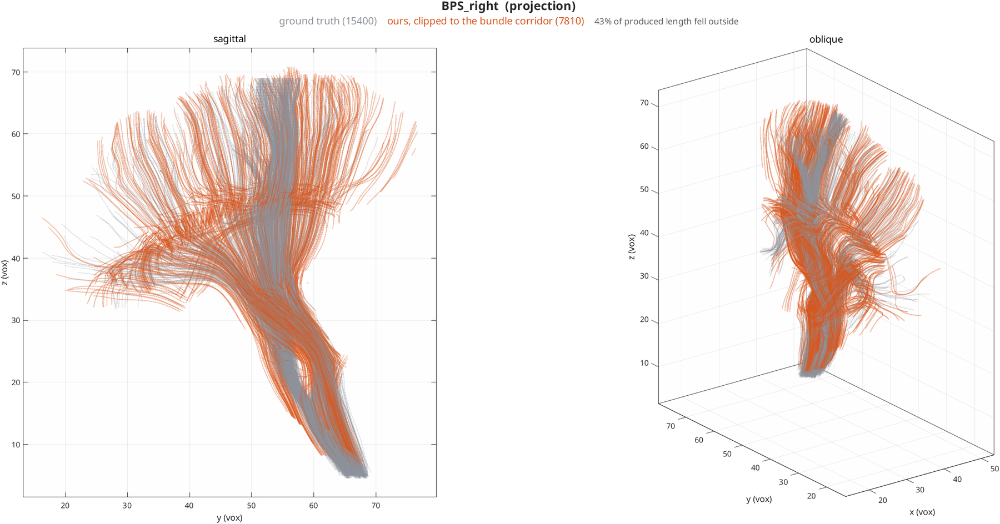
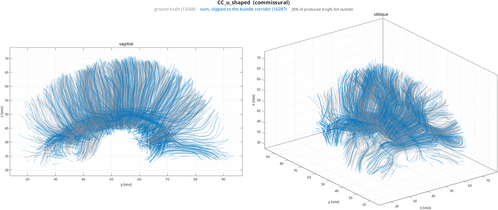
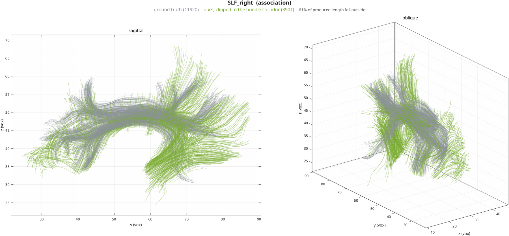
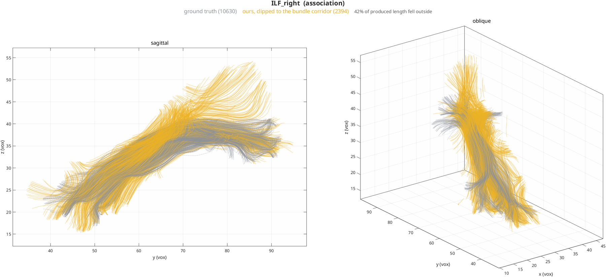
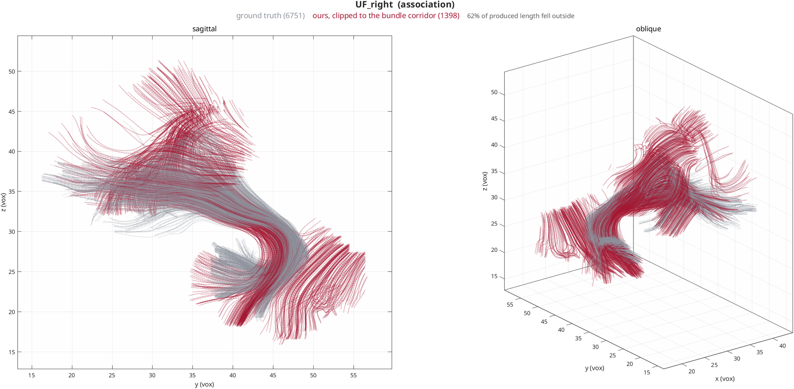
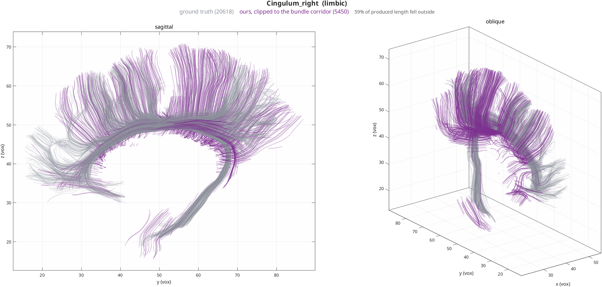

# ISMRM 2015 Tractography Challenge Scoring Analysis

## Overview

The ISMRM scoring data provides **ground truth tractography** for validating fiber tracking algorithms. Based on analysis of `scoring_data_Renauld2023/`.


## Reconstruction against ground truth

Each bundle below is seeded from its own ISMRM mask, tracked with **no
filtering**, and then **clipped** to the bundle's containment corridor for
display. Grey is the ground-truth tractogram; colour is ours.

!!! warning "Clipped, not filtered — and why that distinction matters"
    The scorer defines a bundle by containment: a streamline with *any* point
    outside the corridor is not that bundle and is discarded whole. That is the
    correct rule for scoring and a misleading one for a picture. A streamline
    that follows a bundle correctly and then overshoots past its end gets deleted
    entirely, taking the correct portion with it — so the figure shows a bundle
    that stops short, which reads as the tracker *failing to reach* when what
    actually happened is that it reached too far.

    These figures clip instead, and state how much length was lost, so the
    overshoot is visible rather than hidden.

**How much of each bundle leaves its own corridor:**

| bundle | streamlines | length outside the corridor |
|---|--:|--:|
| CC_u_shaped | 16287 | **28%** |
| ILF_right | 2394 | **42%** |
| BPS_right | 7810 | **43%** |
| Cingulum_right | 5450 | **59%** |
| SLF_right | 3901 | **61%** |
| UF_right | 1398 | **62%** |

That is the honest headline for single-tensor DTI tracking on this phantom:
between a quarter and two thirds of produced streamline length leaves the bundle
it was seeded in. The streamlines are typically correct along the bundle and then
continue past its end onto whichever tract is locally strongest — a crossing
problem, not a termination one. `field: csd` is the intended remedy and has not
yet been evaluated here.

These remain **qualitative** figures, and seeding from a bundle's own mask is a
far easier problem than the whole-brain submission the challenge is designed
around, so none of this constitutes a challenge score.

### Projection



### Commissural



### Association







### Limbic



---

## Data Structure

### Ground Truth Bundles (`bundles/`)

**Format**: TrackVis `.trk` files (binary streamline format)

**22 Major White Matter Bundles**:

- **Commissural**: CA, CC, CP, MCP (corpus callosum variants)

- **Association**: Cingulum (L/R), ILF (L/R), OR (L/R), SLF (L/R), UF (L/R)

- **Projection**: BPS (L/R), ICP (L/R), SCP (L/R)

- **Special**: Fornix

**Bundle Statistics** (from file sizes):
```
Largest bundles:
- Cingulum_right: 29.4 MB (~30K streamlines)
- OR_right: 9.8 MB (~10K streamlines)
- MCP: 30.3 MB (~31K streamlines)
- CC: 24.2 MB (~25K streamlines)

Smallest bundles:
- CP: 331 KB (~340 streamlines)
- CA: 526 KB (~540 streamlines)
- Fornix: 4.1 MB (~4K streamlines)
```

### ROI Masks (`ROI/`)

**Purpose**: Define anatomical constraints for bundle segmentation

**Three types of masks**:

1. **`all_masks/`** (26 files): All streamlines must pass through these regions
    - Example: `CA.nii.gz`, `CC_temporal.nii.gz`, `Fornix.nii.gz`

2. **`any_masks/`** (4 files): At least one streamline point must intersect
    - Used for loose inclusion criteria
    - Example: `MCP_any_mask.nii.gz`, `ICP_left_any_mask.nii.gz`

3. **`endpoints/`** (45 files): Start/end regions for streamlines
    - `*_head.nii.gz`: Starting points
    - `*_tail.nii.gz`: Ending points
    - Shared endpoints: `brainstem.nii.gz`, `occipital_left.nii.gz`

### Configuration Files

#### `config_file_segmentation.json`

**Purpose**: ROI-based bundle segmentation rules

**Structure per bundle**:
```json
{
  "bundle_name": {
    "all_mask": "path/to/required_mask.nii.gz",
    "any_mask": "path/to/inclusion_mask.nii.gz",  // Optional
    "head": "path/to/start_region.nii.gz",
    "tail": "path/to/end_region.nii.gz",
    "length": [min, max],  // mm, optional
    "length_x": [min, max],  // X-axis constraints, optional
    "length_y": [min, max],  // Y-axis constraints, optional
    "length_x_abs": [min, max]  // |X| constraints, optional
  }
}
```

**Example - Corpus Callosum U-shaped**:
```json
{
  "CC_u_shaped": {
    "all_mask": "ROI/all_masks/CC_u_shaped.nii.gz",
    "any_mask": "ROI/any_masks/CC_u_shaped_inclusion_mask.nii.gz",
    "head": "ROI/endpoints/CC_striatal_left.nii.gz",
    "tail": "ROI/endpoints/CC_striatal_right.nii.gz",
    "length": [70, 1000],      // 70-1000mm total length
    "length_y": [0, 32],        // Max 32mm anterior extent
    "length_x_abs": [35, 1000]  // Must span >35mm laterally
  }
}
```

**Geometric Constraints** (7 bundles use these):

- `length`: Total streamline length in mm

- `length_x`, `length_y`, `length_z`: Extent in specific axes

- `length_x_abs`: Absolute X-axis span (for bilateral bundles)

#### `config_file_tractometry.json`

**Purpose**: Map bundle names to ground truth files for tractometry analysis

**Structure**:
```json
{
  "bundle_name": {
    "gt_mask": "bundles/bundle_name.trk"
  }
}
```

Simpler format - just links each bundle to its ground truth `.trk` file.

## Scoring Methodology

### Two Scoring Methods

#### 1. ROI-Based Scoring (Segmentation)

**Method**: Filter user tractography using anatomical ROI constraints

**Process**:

1. Load user's whole-brain tractography
2. Apply ROI constraints from `config_file_segmentation.json`:
    - Keep only streamlines passing through **all** required masks
    - Keep only streamlines with at least one point in **any** masks
    - Keep only streamlines with endpoints in head/tail regions
    - Apply geometric length constraints
3. Compare filtered user tracks to ground truth
4. Compute metrics (see below)

**Advantages**:

- Tests anatomical accuracy of streamlines
- Evaluates tractography algorithm's ability to follow known pathways
- Robust to seeding strategy differences

**Disadvantages**:

- Requires precise ROI mask alignment
- Sensitive to coordinate system errors (see warning below)

#### 2. RecoBundles Scoring (Bundle Recognition)

**Method**: Use machine learning to identify bundles in user tractography

**Process**:

1. Load ground truth bundles as training data
2. Use RecoBundles algorithm to find similar streamlines in user tractography
3. Compare recognized bundles to ground truth
4. Compute metrics

**Advantages**:

- More forgiving of ROI misalignment
- Tests bundle recognition capability
- Simulates clinical bundle identification workflow

**Disadvantages**:

- Requires Dipy RecoBundles implementation
- Less direct test of anatomical accuracy

### Evaluation Metrics (Typical)

Based on standard tractometry evaluation:

1. **Valid Bundles (VB)**: % of submitted bundles passing validity checks
2. **Valid Connections (VC)**: % of correct endpoint connections
3. **Invalid Bundles (IB)**: % of bundles with anatomically impossible paths
4. **Bundle Coverage (BC)**: % of ground truth covered by submission
5. **Bundle Overreach (BO)**: % of submission not in ground truth
6. **Weighted Dice**: Spatial overlap weighted by streamline density

**Formula** (typical):
```
Score = (VB + VC - IB + BC - BO) / normalization_factor
```

## Critical File Format Warning

From the user's note:

> **IMPORTANT**: As of 08.2022, tractograms are loaded through **Dipy's Stateful Tractogram** functions. Previous versions applied automatic **0.5 voxel shifts** when loading TRK files. The new Python3 version **DOES NOT do this anymore**.

### What This Means

**Old behavior** (pre-2022):
```python
# TrackVis TRK files stored in voxel corner coordinates
# Old code automatically shifted by 0.5 to get voxel centers
track_coords_old = raw_trk_coords + 0.5
```

**New behavior** (2022+):
```python
# Dipy StatefulTractogram expects correct space attributes
# NO automatic shifting - relies on header information
track_coords_new = raw_trk_coords  # Uses header space/origin
```

### Impact on HINEC Pipeline

**HINEC tractography output** (`nim_tractography_standard.m`):

- Tracks stored as **voxel indices** (1-based MATLAB)

- Coordinates are in **voxel space**, not world space

- Example: `[47.0, 44.5, 27.9]` = voxel coordinates

**ISMRM ground truth**:

- TRK files with **world space coordinates**

- Header contains voxel-to-world transform

- StatefulTractogram handles coordinate conversion

**THE PROBLEM**:
If you save HINEC tracks as TRK files without proper header setup, the scoring scripts will **misinterpret coordinates**:

- HINEC voxel coords treated as world coords → misalignment

- Or: Missing 0.5 shift causes half-voxel offset

- Result: Bundle ROI filtering fails → score = 0

## How to Use ISMRM Scoring with HINEC

### Option 1: Convert HINEC Tracks to TRK Format

**Required**: Set up proper TRK header with space attributes

```matlab
% In nim_tractography_standard.m or save function:

% Load reference NIfTI to get affine transform
ref_nii = niftiinfo('reference.nii.gz');
affine = ref_nii.Transform.T';  % 4x4 voxel-to-world matrix

% Save tracks with proper header
% Use nibabel in Python:
% - Set header['voxel_to_rasmm'] = affine
% - Set space = 'rasmm' (world space)
% - Set origin = 'nifti' or 'trackvis'
```

**Critical**: Ensure voxel coordinates are transformed to world space OR header specifies voxel space correctly.

### Option 2: Use Python Scoring Script

**Create MATLAB-to-Python bridge**:

```matlab
% Save HINEC tracks in compatible format
function save_for_ismrm(tracks, reference_nii, output_trk)
    % 1. Extract voxel-to-world transform
    % 2. Convert track coordinates if needed
    % 3. Call Python script to create TRK with proper header
    system(sprintf('python hinec_to_trk.py %s %s %s', ...
        tracks_mat, reference_nii, output_trk));
end
```

### Option 3: Adapt ISMRM Scoring for HINEC Format

**Modify scoring scripts** to accept MATLAB `.mat` files:

```python
# In scoring script:
if input_file.endswith('.mat'):
    # Load MATLAB tracks
    mat_data = scipy.io.loadmat(input_file)
    tracks = mat_data['tracks']
    # Convert to StatefulTractogram with reference NIfTI
    sft = StatefulTractogram(tracks, reference_nii, space='vox')
else:
    # Standard TRK loading
    sft = load_tractogram(input_file, reference_nii)
```

## Testing Coordinate Alignment

**Diagnostic Script** (recommended):

```python
#!/usr/bin/env python3
import nibabel as nib
from nibabel.streamlines import load, save
import numpy as np

# Load HINEC tracks (converted to TRK)
sft_hinec = load('hinec_tracks.trk')

# Load ISMRM ground truth
sft_gt = nib.streamlines.load('scoring_data_Renauld2023/bundles/CA.trk')

# Check coordinate ranges
hinec_coords = np.vstack([s for s in sft_hinec.streamlines])
gt_coords = np.vstack([s for s in sft_gt.streamlines])

print("HINEC coord range:")
print(f"  X: [{hinec_coords[:,0].min():.1f}, {hinec_coords[:,0].max():.1f}]")
print(f"  Y: [{hinec_coords[:,1].min():.1f}, {hinec_coords[:,1].max():.1f}]")
print(f"  Z: [{hinec_coords[:,2].min():.1f}, {hinec_coords[:,2].max():.1f}]")

print("\nGround truth coord range:")
print(f"  X: [{gt_coords[:,0].min():.1f}, {gt_coords[:,0].max():.1f}]")
print(f"  Y: [{gt_coords[:,1].min():.1f}, {gt_coords[:,1].max():.1f}]")
print(f"  Z: [{gt_coords[:,2].min():.1f}, {gt_coords[:,2].max():.1f}]")

# Check header info
print("\nHINEC header space:", sft_hinec.space)
print("Ground truth header space:", sft_gt.space)

# Visual alignment check
print("\nTo verify alignment:")
print("1. Load both tractograms in TrackVis or MI-Brain")
print("2. Overlay with T1.nii.gz from scoring_data")
print("3. Check if streamlines follow anatomical structures")
```

## Recommendations for HINEC Pipeline

### Immediate Actions

1. **Add TRK export function** with proper header setup
2. **Implement coordinate space conversion** (voxel → world if needed)
3. **Create alignment test script** (Python-based)
4. **Document coordinate system** in HINEC pipeline

### Medium-term Improvements

1. **Bundle segmentation module** using ISMRM ROI configs
2. **Automated scoring integration** with ISMRM ground truth
3. **Coordinate system validator** (detect and fix misalignments)

### Long-term Goals

1. **ISMRM benchmark suite** for HINEC validation
2. **Performance comparison** against 2015 challenge submissions
3. **Bundle-specific optimization** based on ISMRM metrics

## Key Differences: HINEC vs ISMRM Format

| Aspect | HINEC | ISMRM Ground Truth |
|--------|-------|-------------------|
| **File format** | `.mat` (MATLAB) | `.trk` (TrackVis) |
| **Coordinate system** | Voxel indices (1-based) | World coordinates (RAS+) |
| **Space attribute** | Implicit (voxel) | Explicit (header) |
| **Track storage** | Cell array of Nx3 matrices | Binary streamline format |
| **Metadata** | nim structure | TRK header (affine, dims, etc) |
| **Compatibility** | MATLAB-specific | Universal (Dipy, TrackVis, DSI Studio) |

## Scoring Accuracy Assessment

**How accurate is ISMRM scoring?**

### Strengths

1. **Anatomical Ground Truth**: Based on actual white matter anatomy, not synthetic
2. **Multiple Metrics**: Tests different aspects (coverage, validity, connections)
3. **Standardized**: Used in major challenge, results published
4. **ROI-based**: Tests anatomical knowledge, not just visual similarity

### Limitations

1. **ROI dependency**: Requires precise anatomical masks (manual work)
2. **Single dataset**: Based on one brain (may not generalize)
3. **Coordinate sensitivity**: Alignment errors cause disproportionate penalty
4. **No ground truth certainty**: Even "gold standard" has anatomical uncertainty

### Validation Against Other Methods

Compare with:

- **IronTract**: Anatomical tracing (more accurate but lower throughput)
- **Tractometer**: Synthetic phantoms (perfect ground truth but unrealistic)
- **Clinical consensus**: Expert manual segmentation (subjective but relevant)

**Recommendation**: Use ISMRM as **one of multiple validation methods**:

- ISMRM: Anatomical accuracy
- IronTract: Biological validation
- Synthetic: Algorithm verification
- Clinical: Real-world applicability

## Next Steps

1. ✅ Analyzed ISMRM data structure
2. ✅ Documented scoring methodology
3. ⏳ Create HINEC-to-TRK converter
4. ⏳ Test coordinate alignment
5. ⏳ Run HINEC tracks through ISMRM scoring
6. ⏳ Compare results with challenge submissions

## References

- [ISMRM 2015 Tractography Challenge](http://tractometer.dinf.usherbrooke.ca/ismrm_2015_challenge/)
- [Dipy StatefulTractogram](https://dipy.org/documentation/latest/reference/dipy.io.stateful_tractogram/)
- [TrackVis format spec](http://trackvis.org/docs/?subsect=fileformat)
- [Renauld 2023 update](https://github.com/scilus/ismrm_2015_tractography_challenge_scoring)
