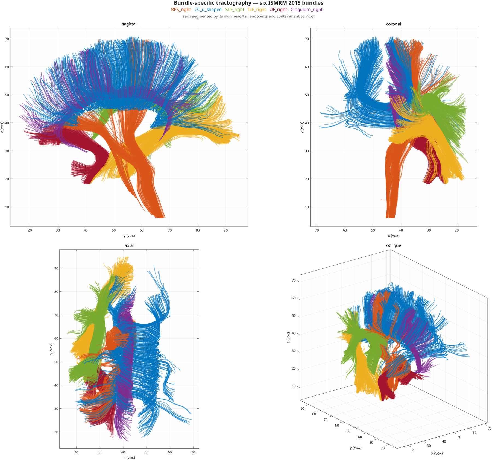

# Tractography Methods

HINEC ships **three trackers** over one shared `nim` struct, selected by the
`algorithm:` key in the config's `tractography:` section. A second axis, `field:`,
chooses whether direction information comes from the **DTI tensor** or from **CSD FOD
peaks**. This page is the map; each tracker links to its own deep-dive.

```
runTractography(nim, config)
        │  dispatch on config.tractography.algorithm   (runTractography.m)
        ├── 'standard' → nim_tractography_standard      FACT, discrete voxel tensors
        ├── 'hinec'    → nim_tractography_hinec          interpolated streamlines
        └── 'mmf'      → nim_tractography_mmf_connframe   connection-form Method of Moving Frames
```

---

## What it produces

Seeding from a region rather than the whole brain gives bundle-specific
tractography. Below, six ISMRM 2015 bundles spanning the major fibre classes,
each seeded from its own mask and filtered by the endpoint pair and containment
corridor that define it — see [`seeding.roi`](YAML_CONFIG.md) and
[`filter.endpoints_in`](YAML_CONFIG.md).



Each is reconstructed independently; they are drawn together here only to show
their spatial relationship. Per-bundle comparisons against ground truth are in
[ISMRM Scoring](ISMRM_SCORING_ANALYSIS.md#reconstruction-against-ground-truth).

---

## The three trackers

| Algorithm | File | Model | Integration | Interpolation | `field` |
|---|---|---|---|---|---|
| `standard` | `nim_tractography_standard.m` | single tensor | Euler (FACT) | none (discrete voxel tensor) | dti |
| `hinec` | `nim_tractography_hinec.m` | tensor **or** CSD FOD | Euler / RK2 / RK4 / RKF45 | trilinear \| cubic \| spline | dti \| csd |
| `mmf` | `nim_tractography_mmf_connframe.m` | tensor **or** CSD FOD | RK4 or RKF45 on the frame system | connection 1-form field | dti \| csd |

### `standard` — FACT

Classic **F**iber **A**ssignment by **C**ontinuous **T**racking. Steps voxel-to-voxel
along the discrete principal eigenvector with no sub-voxel interpolation. Fast, simple,
the reference baseline. Full internals: **[Standard Tractography](TRACTOGRAPHY.md)**.

### `hinec` — interpolated streamlines

The workhorse interpolated tracker. Tracking is **interpolation plus integration only** —
the direction returned is a pure function of position, so classical Runge–Kutta order
theory applies to it.

- **Interpolation.** `interpolation.method` selects the spatial kernel: `trilinear`
  (\(C^0\)), `cubic` (\(C^1\), Keys cubic convolution — not a spline), or `spline`
  (\(C^2\)). The kernel's smoothness caps the order the integrator can actually reach;
  measured orders are in [Solution Verification](CONVERGENCE.md).
  `interpolation.upsample` resamples the field onto a grid of spacing `1/upsample` voxels
  before the interpolants are built (`>1` refines, `<1` coarsens) without changing the
  coordinate frame.
- **Integration.** `integrator.method` = `euler`, `rk2`, `rk4` (default), or `rkf45`
  (Dormand–Prince embedded pair with adaptive stepping; `integrator.adaptive`,
  `tolerance`, `step_min`, `step_max`, `safety`). See [RKF45](RKF.md).
- **`field: dti`** interpolates the **dyadic** \( v_1 v_1^{\mathsf T} \) and takes its
  principal eigenvector, which is sign-invariant — interpolating signed eigenvector
  components would average across the arbitrary per-voxel sign of a line field.
  **`field: csd`** tracks **FOD peaks**: at each step the peak nearest the incoming tangent
  is taken, which reduces a multi-valued field to one direction and resolves crossings by
  approach direction. Requires the CSD peak field (see [below](#csd-fod-reconstruction)).
- **ACT** (Anatomically Constrained Tractography), off by default (`tractography.act`),
  active only when WM/GM/CSF masks are present in the `nim`.

!!! note "`sel_power` has been removed"
    Earlier versions re-weighted each stencil voxel by \( |n\cdot v|^{\text{sel\_power}} \),
    the alignment of its direction with the incoming tangent. For DTI there is one principal
    eigenvector per voxel and so nothing to disambiguate; the term simply bent a
    single-valued field toward the current heading, making the ODE direction-dependent
    (\( dx/ds = v(x, dx/ds) \)) and putting it outside classical order theory. It is gone
    from `hinec`. MMF keeps its own, separate `mmf.frame_sel_power` for building the frame
    field. Nearest-peak selection under `field: csd` is retained because it is structural,
    not a tunable steering term.

!!! note "Renaming (July 2026)"
    `hinec` is the tracker previously **mislabelled** `algorithm: mmf` with
    `integrator: rkf45`. It has nothing to do with the Method of Moving Frames. The name
    `mmf` now belongs to the genuine connection-form tracker below.

### `mmf` — connection-form Method of Moving Frames

Chun & Peng (in preparation). Builds an orthonormal **moving-frame
field** {e1, e2, e3} plus its **connection 1-form** (curvature + torsion) into the `nim`
(`main.m` Step 2b), then traces by evolving a carried frame with the connection structure
equation — not by re-sampling a direction field. `field: csd` builds a *per-peak*
connection, giving multiple pathways through crossings. Full internals:
**[MMF Connection-Form Tractography](MMF_TRACTOGRAPHY.md)**.

---

## The `field:` axis — DTI vs CSD

Both `hinec` and `mmf` accept `field: dti` (default) or `field: csd`.

- **`dti`** — direction(s) from the diffusion-tensor principal eigenvector. One direction
  per voxel; cannot represent crossings.
- **`csd`** — direction(s) from **Constrained Spherical Deconvolution** FOD peaks. Up to
  `csd.max_peaks` fiber populations per voxel; resolves crossings.

### CSD FOD reconstruction

`src/nim_calculation/nim_csd.m` — a native single-shell, single-tissue CSD (Tournier 2007):

1. real spherical-harmonic fit of the DW signal (design matrix from bvecs, `lmax`),
2. single-fiber **response function** estimated from high-FA voxels,
3. constrained spherical deconvolution (iterative non-negativity),
4. **peak extraction** from the FOD.

It writes peaks into the **same interface** the multi-direction trackers consume, so CSD and
the DTI field are interchangeable upstream of tracking:

| `nim` field | Meaning |
|---|---|
| `nim.peaks`   `[X Y Z maxK 3]` | up to `maxK` unit peak directions per voxel |
| `nim.npeaks`  `[X Y Z]`        | number of valid peaks per voxel |
| `nim.peak_w`  `[X Y Z maxK]`   | peak amplitudes (used by [SIFT](#sift-tractogram-filtering)) |
| `nim.fod_sh`                   | SH FOD coefficients |

**Provisioning & caching.** `runTractography` provisions the peaks **before** the algorithm
dispatch, so any tracker running `field: csd` — `hinec` and `mmf` alike — gets them. The FOD
is computed once with `nim_csd` and cached next to the source nim as `<source>_csd.mat`
(e.g. `data/ismrm2015/ismrm2015_csd.mat`); later runs load the cache.

**CSD parameters** (config section `tractography.csd`):

| Key | Default | Meaning |
|---|---|---|
| `lmax` | 6 | SH order (capped by the number of directions) |
| `max_peaks` | 3 | max peaks kept per voxel |
| `peak_thresh` | 0.5 | min peak amplitude (fraction of max FOD) |
| `peak_min_sep` | 45 | min angular separation between peaks (deg) |
| `n_iter` | 50 | deconvolution iterations |

---

## SIFT — tractogram filtering

`src/nim_tractography/nim_sift.m` + `bin/run_sift.sh`. A **post-processing** filter
(Smith 2013 analog, per-lobe): it prunes streamlines so that streamline density on each FOD
**lobe** matches that lobe's FOD amplitude. Each streamline segment is attributed to the FOD
peak it best aligns with; lobes carrying more density than their amplitude warrants are
over-represented, and streamlines running through them are removed. This cuts **overreach**
(false-positive spray) for precision, and — unlike a per-voxel density match — distinguishes
a legitimately dense bundle from invalid spray loading a weak/wrong lobe.

Requires a CSD FOD field (`nim.peaks` + `nim.peak_w`). No re-tracking — it filters an
existing run's tractogram into a **new scorable run dir**:

```bash
./bin/run_sift.sh <run_dir> [--score] [--set sift_key=val ...] [--csd <csd.mat>]
```

| Key | Default | Meaning |
|---|---|---|
| `sift_batch_frac` | 0.03 | fraction of streamlines removed per iteration |
| `sift_n_iter` | 60 | max iterations |
| `sift_min_keep` | 0.20 | floor on fraction of streamlines kept |
| `sift_align_pow` | 1 | weight excess by mis-alignment (0 = off) |

Output → `hinec_runs/<run>_sift/`. With `--score`, runs the
[ISMRM scorer](ISMRM_SCORING_ANALYSIS.md) on the filtered result.

---

## PFT — external baseline (DIPY)

`scripts/run_pft_dipy.py` — **Particle Filtering Tractography** (Girard 2014) via DIPY, the
winning ISMRM-2015 approach per Renauld 2023: CSD FOD + probabilistic tracking + CMC
anatomical priors + particle-filter backtracking. It exists as a **comparison baseline** for
the recall/overlap deficit of deterministic tracking, and emits a `.trk` (RAS world) for the
same scilpy scorer. Tissue masks are the DWI-space masks from HINEC preprocessing (no
T1→DWI registration to misalign).

```bash
python scripts/run_pft_dipy.py --out tracks.trk [--density 1] [--seed wm|interface] [--rng K]
```

---

## Track data structure

Every tracker returns the same structure: `tracks` is a cell array; each cell is an `N×3`
matrix of **voxel-space** coordinates giving the *complete* trajectory (not just endpoints);
`N` varies per fiber. Saved under `<run_dir>/tractography/tracks_<algorithm>_<timestamp>.mat`
together with `options`, `elapsed_time`, and `algorithm`.

---

## Config-driven experiment workflow

**Preprocess once, then iterate tractography** without re-preprocessing. This is the
sanctioned way to run experiments — do **not** hand-write MATLAB batch scripts or hand-create
run dirs.

**1. Preprocess once** (`main.m` writes the canonical nim to the *data layer*, plus a copy in
the run dir, and reuses an existing preprocessed DWI if present):

```bash
./bin/run_hinec.sh data/ismrm2015/ismrm2015 ismrm2015.mat config/ismrm2015.yml
# → data/ismrm2015/ismrm2015.mat  (canonical processed nim)
```

**2. Iterate tractography** (auto-sourced from the data-layer nim; each run gets its own
tagged, scorable run dir):

```bash
# single config
./bin/run_tractography.sh hinec_csd --score

# design-space sweep with --set (DSE), no new YAML per point
for d in 4 8 16; do
  ./bin/run_tractography.sh hinec_csd --score --set seeding.density=$d
done
```

- `<config>` accepts `config/<name>.yml`, `<name>.yml`, or bare `<name>`.
- **Source** defaults to `data/ismrm2015/ismrm2015.mat`; override with
  `--source <nim.mat | run_dir>`. The DWI reference is **copied (frozen)** into the new run's
  `intermediate/` (+ `SOURCE.txt`) so a later reprocess can't corrupt an old run's scoring
  reference.
- **`--set key=value`** overrides any schema parameter on the CLI, addressed by canonical
  path (`tractography.integrator.step`), by path with the section assumed
  (`integrator.step`), or by a bare leaf name when it is unique (`upsample`). Unknown or
  ambiguous keys are an error, not a silent no-op. The run-dir name is tagged with the
  overrides and `overrides.txt` records them.
- **`--score`** runs `bin/run_ismrm_scoring.sh` on the run dir →
  `scoring/renauld2023/results.json` (headline keys `mean_f1`, `mean_OL`, `mean_OR_gt`,
  `VB`). Compare runs by that JSON.

**Data layer vs run dirs.** The nim + preprocessed refs + CSD cache
(`data/ismrm2015/ismrm2015_csd.mat`) live in `data/ismrm2015/`; `hinec_runs/run_*/` hold
tractography **outputs only**. Never store a nim inside a run dir.

See also [Run Directory System](RUN_DIRECTORY_SYSTEM.md) and
[ISMRM Scoring](ISMRM_SCORING_ANALYSIS.md).

---

## Choosing a tracker

| Goal | Start with |
|---|---|
| Fast baseline / sanity check | `standard` (`config/standard_dti.yml`) |
| Best deterministic single-tensor result | `hinec` + `field: dti` (`config/hinec_dti.yml`; loosen `termination.angle_max` / `termination.fa_min` to push recall) |
| Crossings resolved by FOD | `hinec` + `field: csd` (`config/hinec_csd.yml`) |
| Intrinsic curvature/torsion geometry | `mmf` (`config/mmf_dti.yml` / `mmf_csd.yml`) |
| Cut overreach after tracking | any of the above, then [`run_sift.sh`](#sift-tractogram-filtering) |
| Probabilistic recall reference | PFT baseline (`scripts/run_pft_dipy.py`) |

[YAML Config](YAML_CONFIG.md) documents every parameter; it is generated from
`src/nim_utils/nim_config_schema.m`, the single source of truth for the config surface.
`config/README.md` lists the shipped presets and the naming rule they follow.
