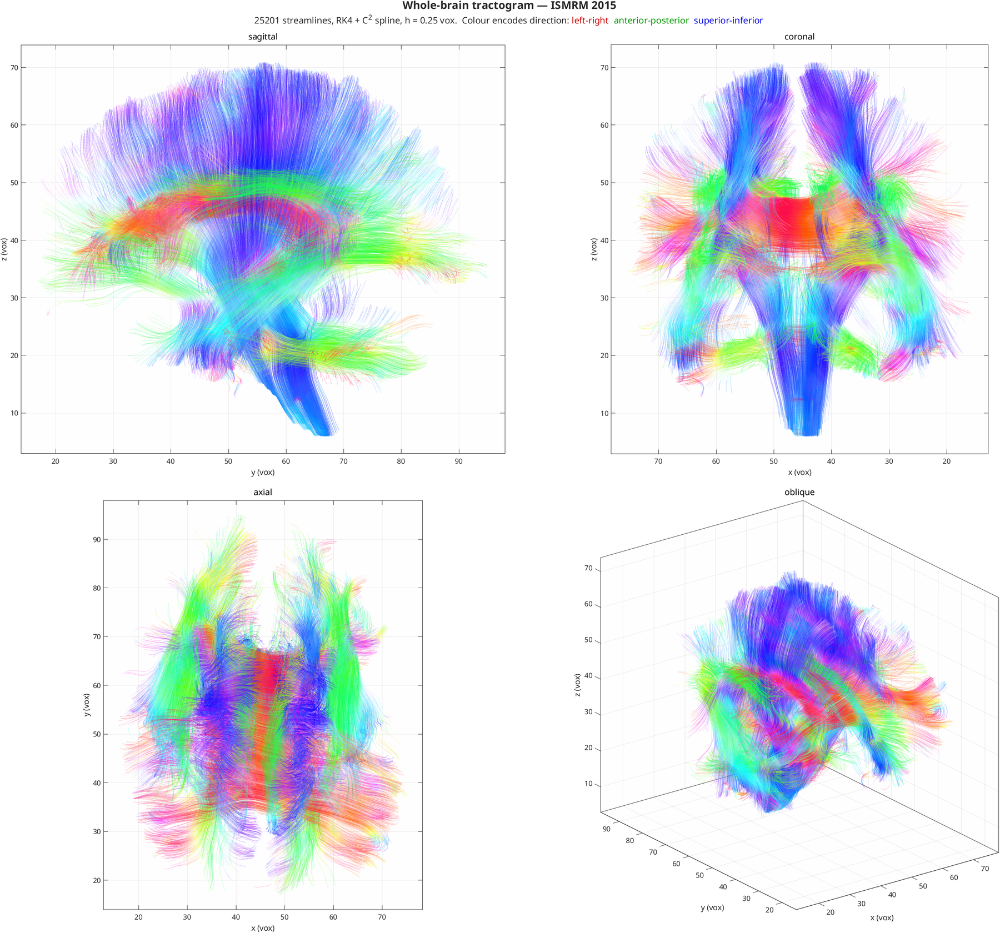

# HINEC: HIgh-order NEural Connectivity

Human brain white matter tractography pipeline with YAML-based parameter configuration.



*Whole-brain tractogram of the ISMRM 2015 phantom — RK4 with a C² spline
interpolant. Colour encodes direction: red left–right, green anterior–posterior,
blue superior–inferior.*

## Pipeline

HINEC takes raw diffusion-weighted MRI (dMRI) and produces streamline tractography,
in six stages:

1. **Preprocessing** — denoising, motion and eddy-current correction, brain
   extraction and registration, via FSL
2. **Diffusion tensor estimation** — SPD-constrained fitting
3. **FA computation** — fractional anisotropy maps
4. **Parcellation** — atlas-based brain region labelling
5. **Tractography** — FACT, interpolated high-order streamlines, or
   connection-form Method of Moving Frames
6. **Visualization** — 3D rendering and pre-cached slice viewing

Three trackers share one processed `nim` struct, selected by `algorithm:` in the
config: `standard` (FACT, discrete voxel tensors), `hinec` (interpolated direction
field, Euler/RK2/RK4/RKF45 integration, optional ACT) and `mmf` (moving frames
driven by the connection 1-form). The direction source is `dti` (tensor principal
eigenvector) or `csd` (FOD peaks), independently of the integrator.

## Quick Start

Preprocess once, then iterate on tractography:

```bash
# Build the processed nim (preprocessing + DTI + FA + parcellation)
./bin/run_hinec.sh data/ismrm2015/ismrm2015 ismrm2015.mat config/ismrm2015.yml

# Track on the already-processed nim — one run directory per config
./bin/run_tractography.sh hinec_dti --score

# Sweep a parameter without writing a new config
./bin/run_tractography.sh hinec_dti --set integrator.step=0.05
```

Or from MATLAB:

```matlab
config   = load_config_yaml('config/hinec_dti.yml');
run_info = create_run_directory('config/hinec_dti.yml');
main('data/ismrm2015/ismrm2015', 'ismrm2015.mat', config, run_info);
runTractography(fullfile(run_info.output_dir, 'ismrm2015.mat'), config, run_info);
```

## Navigation

| Section | Description |
|---|---|
| [Getting Started](USER_GUIDE.md) | Prerequisites, installation and first run |
| [Pipeline](PIPELINE.md) | End-to-end data flow and module overview |
| [Tractography](TRACTOGRAPHY_METHODS.md) | Standard, high-order and MMF fibre tracking |
| [Configuration](YAML_CONFIG.md) | YAML parameter reference |
| [Visualization](VISUALIZATION_GUIDE.md) | 3D and distributed slice viewing |
| [API Reference](API_REFERENCE.md) | Complete function reference |
| [Math Foundations](MATHEMATICAL_FOUNDATIONS.md) | Formulas and numerical methods |
| [Solution Verification](CONVERGENCE.md) | Convergence under refinement, and the observed order |
| [Team](ABOUT.md) | Researchers and advisor |
