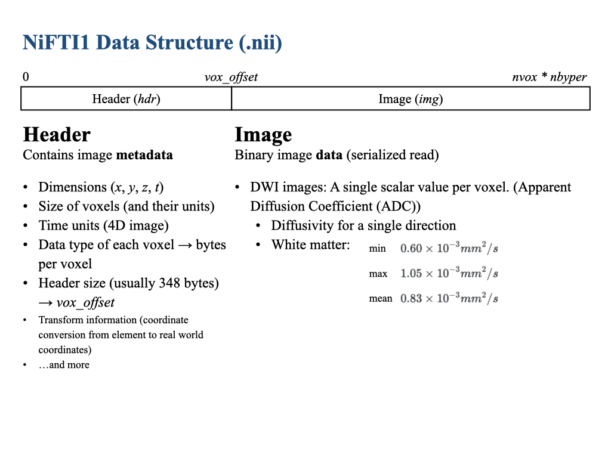

# NiFTI1 File Format

NiFTI(Neuroimaging Informatics Technology Initiative) is a data format for storing raw or analyzed neuro images.

> [R.W. Cox, et al. (2004) A (Sort of) New Image Data Format Standard: NIfTI-1](https://nifti.nimh.nih.gov/nifti-1/documentation/hbm_nifti_2004.pdf)



## Sample Data
* `*.bvec` x, y, z components of normalized (b-vectors) (direction of applied magnetic resonance gradients)
* `*.bval` b-values - the magnitude of applied magnetic gradients
* `*.nii.gz` NiFTI-1 formatted data file

## NiFTI Standard
* `nifti1.h` NiFTI header struct for reading NiFTI1 files with C (by Bob Cox, SSCC, [NIMH](https://nifti.nimh.nih.gov))

## Data Source
```json
{
    "Name": "DWI Traveling Human Phantom Study",
    "BIDSVersion": "1.0.0",
    "License": "CC0",
    "Authors": [
        "Vincent A. Magnotta",
        "Joy T. Matsui",
        "Dawei Liu",
        "Hans J. Johnson",
        "Jeffrey D. Long",
        "Bradley D. Bolster Jr",
        "Bryon A. Mueller",
        "Kelvin Lim",
        "Susumu Mori",
        "Karl G. Helmer",
        "Jessica A. Turner",
        "Sarah Reading",
        "Mark J. Lowe",
        "Elizabeth Aylward",
        "Laura A. Flashman",
        "Greg Bonett",
        "Jane S. Paulsen"
    ],
    "HowToAcknowledge": "Please reference the following papers:  DOI: 10.1089/brain.2012.0112 V. a. Magnotta, J. T. Matsui, D. Liu, H. J. Johnson, J. D. Long, B. D. Bolster, B. a. Mueller, K. O. Lim, S. Mori, K. Helmer, J. a. Turner, M. J. Lowe, E. Aylward, L. a. Flashman, G. Bonett, and J. S. Paulsen, 'Multi-Center Reliability of Diffusion Tensor Imaging,' Brain Connect., vol. 2, no. 6, p. 121018043201009, Jan. 2012.",
    "Funding": "This work was supported, in part, by awards from CHDI Foundation, Inc.; NIH R01NS050568; NINDS NS40068 Neu- robiological Predictors of Huntington's Disease; and NINDS R01 NS054893 Cognitive and Functional Brain Changes in Preclinical HD. Dr. Turner was supported by NCRR 1 U24 RR021992 from the Functional Imaging Biomedical Infor- matics Network (S.G. Potkin, PI) for her work on this project while at the University of California, Irvine. This publication was supported by the National Center for Research Resour- ces and the National Center for Advancing Translational Sciences, National Institutes of Health, through Grant UL1RR024979. The content is solely the responsibility of the authors and does not necessarily represent the official views of the NIH.",
    "ReferencesAndLinks": [
        "http://online.liebertpub.com/doi/abs/10.1089/brain.2012.0112"
    ],
    "DatasetDOI": "10.18112/openneuro.ds000206.v1.0.0"
}
```